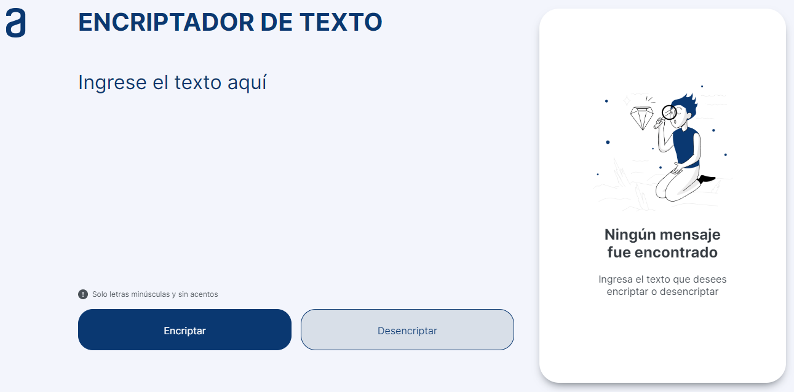

<h1>ENCRIPTADOR DE TEXTO :mag:</h1>

 

<h2>Descripción del proyecto :bulb:</h2>

Encriptador de texto realizado para el Challenge ONE Front End de Alura-Latam. Esta página web permite encriptar y desencriptar un texto, además de copiarlo al portapapeles.

<h3>Funcionalidad :wrench:</h3>

La encriptación funciona de ida y vuelta usando las claves: 
 :small_blue_diamond: La letra "a" es convertida para "al"
 :small_blue_diamond: La letra "e" es convertida para "enter"
 :small_blue_diamond: La letra "i" es convertida para "imes"
 :small_blue_diamond: La letra "o" es convertida para "ober"
 :small_blue_diamond: La letra "u" es convertida para "ufat"

<h3>Requisitos :clipboard:</h3>

:heavy_check_mark: Debe funcionar solo con letras minúsculas
 :heavy_check_mark: No deben ser utilizados letras con acentos ni caracteres especiales.
 :heavy_check_mark: La página debe tener campos para la inserción del texto que será encriptado o desencriptado.
 :heavy_check_mark: El usuario debe poder escoger entre las dos opciones: encriptar o desencriptar.
 :heavy_check_mark: El resultado debe ser mostrado en la pantalla.

<h3>Ejemplo :thumbsup:</h3>      

_galtober_<=>_galtober_=>_gato-gray?style=flat">

<h3>Extras :star:</h3>

Un botón que copie el texto encriptado/desencriptado para la sección de transferencia, o sea que tenga la misma funcionalidad del ctrl+C o de la opción "copiar" del menú de las aplicaciones.

<h2>Acceso al proyecto :link:</h2>

Git Hub: https://github.com/VannDennOk/encriptador-texto-alura
 Git Hub Page: https://vanndennok.github.io/encriptador-texto-alura

<h2>Autoría :woman:</h2>

El proyecto fue desarrollado por Vanina Denegri en base a los diseños provistos por Alura-Latam.
 Mi perfil de Git Hub: https://github.com/VannDennOk
 Mi perfil de LinkedIn: https://www.linkedin.com/in/vaninadenegri

